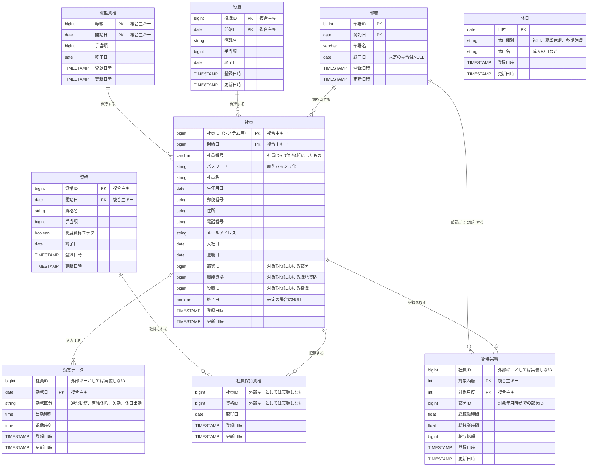

```mermaid
erDiagram

    社員 {
        bigint 社員ID（システム用） PK "複合主キー"
        bigint 開始日 PK "複合主キー"
        varchar 社員番号 "社員IDを0付き4桁にしたもの"
        string パスワード "原則ハッシュ化"
        string 社員名
        date 生年月日
        string 郵便番号
        string 住所
        string 電話番号
        string メールアドレス
        date 入社日
        date 退職日
        bigint 部署ID "対象期間における部署"
        bigint 職能資格 "対象期間における職能資格"
        bigint 役職ID "対象期間における役職"
        boolean 終了日 "未定の場合はNULL"
        TIMESTAMP 登録日時
        TIMESTAMP 更新日時
    }

    部署 {
        bigint 部署ID PK
        date 開始日 PK
        varchar 部署名 
        date 終了日 "未定の場合はNULL"
        TIMESTAMP 登録日時
        TIMESTAMP 更新日時
    }

    資格 {
        bigint 資格ID PK "複合主キー"
        date 開始日 PK "複合主キー"
        string 資格名
        bigint 手当額
        boolean 高度資格フラグ
        date 終了日
        TIMESTAMP 登録日時
        TIMESTAMP 更新日時
    }

    社員保持資格 {
        bigint 社員ID  "外部キーとしては実装しない"
        bigint 資格ID  "外部キーとしては実装しない"
        date 取得日 
        TIMESTAMP 登録日時
        TIMESTAMP 更新日時
    }

    役職 {
        bigint 役職ID PK "複合主キー"
        date 開始日 PK "複合主キー"
        string 役職名
        bigint 手当額
        date 終了日
        TIMESTAMP 登録日時
        TIMESTAMP 更新日時
    }

    職能資格 {
        bigint 等級 PK "複合主キー"
        date 開始日 PK "複合主キー"
        bigint 手当額 
        date 終了日
        TIMESTAMP 登録日時
        TIMESTAMP 更新日時
    }

    勤怠データ {
        bigint 社員ID "外部キーとしては実装しない"
        date 勤務日 PK "複合主キー"
        string 勤務区分 "通常勤務、有給休暇、欠勤、休日出勤"
        time 出勤時刻
        time 退勤時刻
        TIMESTAMP 登録日時
        TIMESTAMP 更新日時
    }

    休日 {
        date 日付 PK
        string 休日種別 "祝日、夏季休暇、冬期休暇"
        string 休日名 "成人の日など"
        TIMESTAMP 登録日時
        TIMESTAMP 更新日時
    }

    給与実績 {
        bigint 社員ID "外部キーとしては実装しない"
        int 対象西暦 PK "複合主キー"
        int 対象月度 PK "複合主キー"
        bigint 部署ID "対象年月時点での部署ID"
        float 総稼働時間
        float 総残業時間
        bigint 給与総額
        TIMESTAMP 登録日時
        TIMESTAMP 更新日時
    }

    部署 ||--o{ 社員 : 割り当てる

    社員 ||--o{ 社員保持資格 : 記録する
    資格 ||--o{ 社員保持資格 : 取得される

    役職 ||--o{ 社員 : 保持する

    職能資格 ||--o{ 社員 : 保持する

    社員 ||--o{ 勤怠データ : 入力する

    社員 ||--o{ 給与実績 : 記録される
    部署 ||--o{ 給与実績 : 部署ごとに集計する
```
