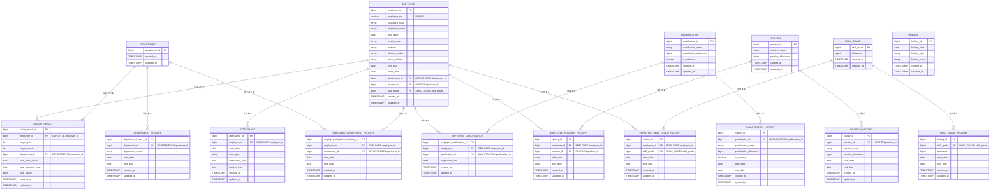

```mermaid
erDiagram

    EMPLOYEE {
        bigint employee_id PK
        varchar employee_no "UNIQUE"
        string password_hash
        string employee_name
        date birth_date
        string postal_code
        string address
        string phone_number
        string email_address
        date hire_date
        date retire_date
        bigint department_id FK "DEPARTMENT.department_id"
        bigint position_id FK "POSITION.position_id"
        bigint skill_grade FK "SKILL_GRADE.skill_grade"
        TIMESTAMP created_at
        TIMESTAMP updated_at
    }

    DEPARTMENT {
        bigint department_id PK
        TIMESTAMP created_at
        TIMESTAMP updated_at
    }

    DEPARTMENT_HISTORY {
        bigint department_history_id PK
        bigint department_id FK "DEPARTMENT.department_id"
        string department_name
        date start_date
        date end_date
        TIMESTAMP created_at
        TIMESTAMP updated_at
    }

    EMPLOYEE_DEPARTMENT_HISTORY {
        bigint employee_department_history_id PK
        bigint employee_id FK "EMPLOYEE.employee_id"
        bigint department_id FK "DEPARTMENT.department_id"
        date start_date
        date end_date
        TIMESTAMP created_at
        TIMESTAMP updated_at
    }

    QUALIFICATION {
        bigint qualification_id PK
        string qualification_name
        bigint qualification_allowance
        boolean is_advance
        TIMESTAMP created_at
        TIMESTAMP updated_at
    }

    QUALIFICATION_HISTORY {
        bigint history_id PK
        bigint qualification_id FK "QUALIFICATION.qualification_id"
        string qualification_name
        bigint qualification_allowance
        boolean is_advance
        date start_date
        date end_date
        TIMESTAMP created_at
        TIMESTAMP updated_at
    }

    EMPLOYEE_QUALIFICATION {
        bigint employee_qualification_id PK
        bigint employee_id FK "EMPLOYEE.employee_id"
        bigint qualification_id FK "QUALIFICATION.qualification_id"
        date acquisition_date
        TIMESTAMP created_at
        TIMESTAMP updated_at
    }

    POSITION {
        bigint position_id PK
        string position_name
        bigint position_allowance
        TIMESTAMP created_at
        TIMESTAMP updated_at
    }

    POSITION_HISTORY {
        bigint history_id PK
        bigint position_id FK "POSITION.position_id"
        string position_name
        bigint position_allowance
        date start_date
        date end_date
        TIMESTAMP created_at
        TIMESTAMP updated_at
    }

    EMPLOYEE_POSITION_HISTORY {
        bigint history_id PK
        bigint employee_id FK "EMPLOYEE.employee_id"
        bigint position_id FK "POSITION.position_id"
        date start_date
        date end_date
        TIMESTAMP created_at
        TIMESTAMP updated_at
    }

    SKILL_GRADE {
        bigint skill_grade PK
        bigint allowance
        TIMESTAMP created_at
        TIMESTAMP updated_at
    }

    SKILL_GRADE_HISTORY {
        bigint history_id PK
        bigint skill_grade FK "SKILL_GRADE.skill_grade"
        bigint allowance
        date start_date
        date end_date
        TIMESTAMP created_at
        TIMESTAMP updated_at
    }

    EMPLOYEE_SKILL_GRADE_HISTORY {
        bigint history_id PK
        bigint employee_id FK "EMPLOYEE.employee_id"
        bigint skill_grade FK "SKILL_GRADE.skill_grade"
        date start_date
        date end_date
        TIMESTAMP created_at
        TIMESTAMP updated_at
    }

    ATTENDANCE {
        bigint attendance_id PK
        bigint employee_id FK "EMPLOYEE.employee_id"
        date work_date
        string work_type
        time attendance_time
        time leaving_time
        TIMESTAMP created_at
        TIMESTAMP updated_at
    }

    HOLIDAY {
        bigint holiday_id PK
        date holiday_date
        string holiday_type
        string holiday_name
        TIMESTAMP created_at
        TIMESTAMP updated_at
    }

    SALARY_RESULT {
        bigint salary_result_id PK
        bigint employee_id FK "EMPLOYEE.employee_id"
        int target_year
        int target_month
        bigint department_id FK "DEPARTMENT.department_id"
        float total_work_hours
        float total_overtime_hours
        bigint total_salary
        TIMESTAMP created_at
        TIMESTAMP updated_at
    }

    DEPARTMENT ||--o{ DEPARTMENT_HISTORY : 記録する
    DEPARTMENT ||--o{ EMPLOYEE_DEPARTMENT_HISTORY : 割り当てる

    EMPLOYEE ||--o{ EMPLOYEE_DEPARTMENT_HISTORY : 記録する

    QUALIFICATION ||--o{ QUALIFICATION_HISTORY : 変更する
    EMPLOYEE ||--o{ EMPLOYEE_QUALIFICATION : 取得する
    QUALIFICATION ||--o{ EMPLOYEE_QUALIFICATION : 保持する

    POSITION ||--o{ POSITION_HISTORY : 変更する
    EMPLOYEE ||--o{ EMPLOYEE_POSITION_HISTORY : 記録する
    POSITION ||--o{ EMPLOYEE_POSITION_HISTORY : 保持する

    SKILL_GRADE ||--o{ SKILL_GRADE_HISTORY : 変更する
    EMPLOYEE ||--o{ EMPLOYEE_SKILL_GRADE_HISTORY : 記録する
    SKILL_GRADE ||--o{ EMPLOYEE_SKILL_GRADE_HISTORY : 保持する

    EMPLOYEE ||--o{ ATTENDANCE : 入力する

    EMPLOYEE ||--o{ SALARY_RESULT : 記録される
    DEPARTMENT ||--o{ SALARY_RESULT : 記録される
```
