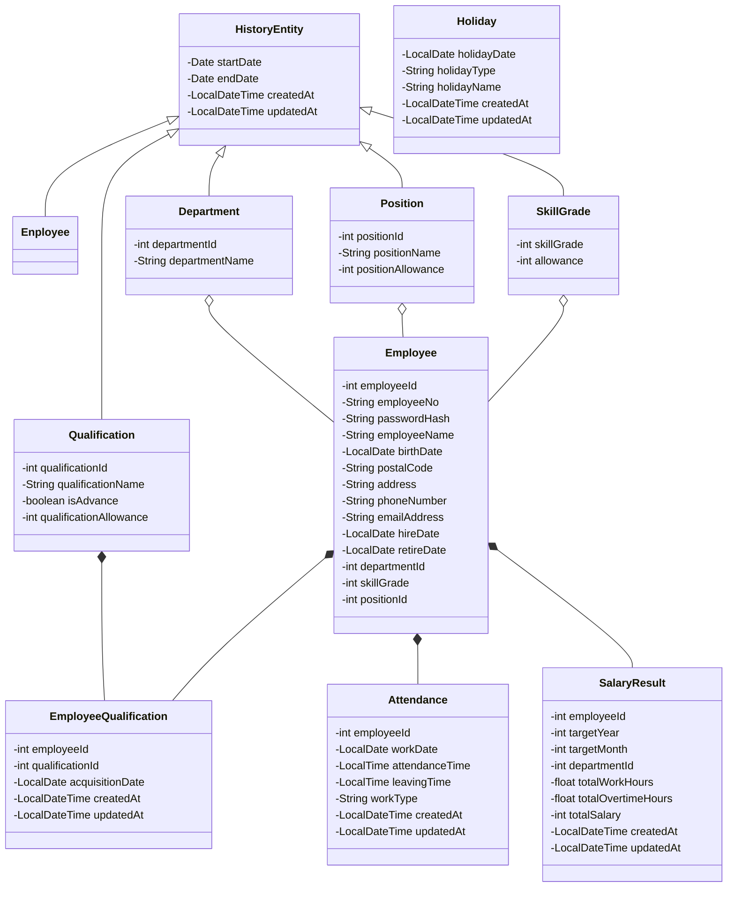

```mermaid
classDiagram

    class HistoryEntity {
        -Date startDate
        -Date endDate
        -LocalDateTime createdAt
        -LocalDateTime updatedAt
    }

    HistoryEntity <|-- Enployee
    HistoryEntity <|-- Department
    HistoryEntity <|-- Qualification
    HistoryEntity <|-- Position
    HistoryEntity <|-- SkillGrade

    class Employee {
        -int employeeId
        -String employeeNo
        -String passwordHash
        -String employeeName
        -LocalDate birthDate
        -String postalCode
        -String address
        -String phoneNumber
        -String emailAddress
        -LocalDate hireDate
        -LocalDate retireDate
        -int departmentId
        -int skillGrade
        -int positionId
    }

    class Department {
        -int departmentId
        -String departmentName
    }

    Department o-- Employee

    class Qualification {
        -int qualificationId
        -String qualificationName
        -boolean isAdvance
        -int qualificationAllowance
    }

    class EmployeeQualification {
        -int employeeId
        -int qualificationId
        -LocalDate acquisitionDate
        -LocalDateTime createdAt
        -LocalDateTime updatedAt
    }

    Qualification *-- EmployeeQualification
    Employee *-- EmployeeQualification

    class Position {
        -int positionId
        -String positionName
        -int positionAllowance
    }

    Position o-- Employee

    class SkillGrade {
        -int skillGrade
        -int allowance
    }

    SkillGrade o-- Employee

    class Holiday {
        -LocalDate holidayDate
        -String holidayType
        -String holidayName
        -LocalDateTime createdAt
        -LocalDateTime updatedAt
    }

    class Attendance {
        -int employeeId
        -LocalDate workDate
        -LocalTime attendanceTime
        -LocalTime leavingTime
        -String workType
        -LocalDateTime createdAt
        -LocalDateTime updatedAt
    }

    Employee *-- Attendance

    class SalaryResult {
        -int employeeId
        -int targetYear
        -int targetMonth
        -int departmentId
        -float totalWorkHours
        -float totalOvertimeHours
        -int totalSalary
        -LocalDateTime createdAt
        -LocalDateTime updatedAt
    }

    Employee *-- SalaryResult
```